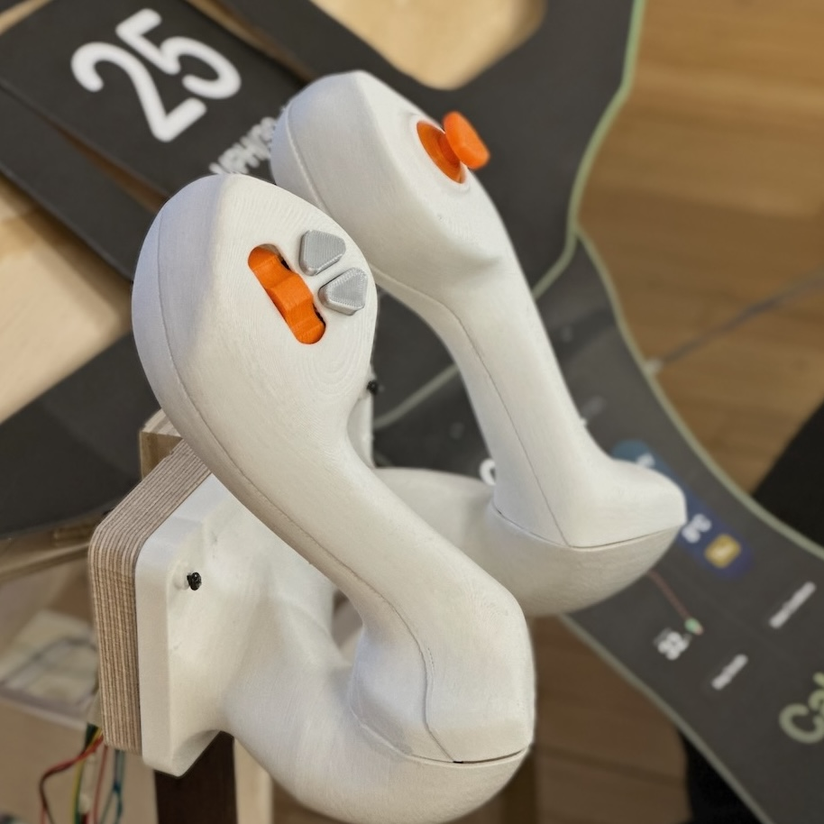
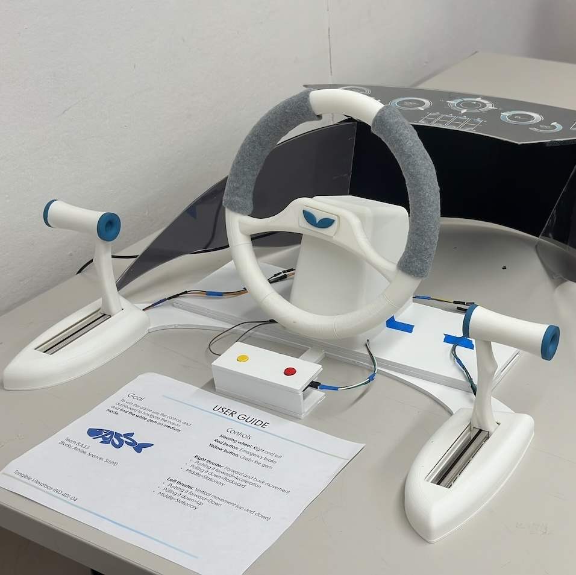

# Tangible Interfaces Lab

Contents

- TOC
{:toc}

The Tangible Interfaces Lab at Pratt Institute, created by
[Steve Turbek](https://turbek.com), explores interaction design beyond the touchscreen. We design for touch, hearing, and the many other senses that people possess.

["Software is eating the world"](https://www.wsj.com/articles/SB10001424053111903480904576512250915629460) claimed Marc Andreessen in 2011. Many consumer products, from cameras to "walkmen" to car dashboards are now simply apps on featureless glass screens. This leads to bland product design and customer dissatisfaction. In car design, touch screens have become a safety concern. ["Touch Screen controls take four times longer to perform simple tasks"](https://www.vibilagare.se/english/physical-buttons-outperform-touchscreens-new-cars-test-finds)

**Tangible Interfaces are an opportunity for designers.** When &ldquo;everything is an app and all apps look the same&rdquo; physical interaction is an opportunity for industrial designers to create innovative new
products.

What's your favorite instance of <b>haptic nostalgia</b> —the poignant memory of the physicality of an obsolete thing—like dialing a rotary phone, shifting gears in a manual transmission, opening a soda can with a pull ring?
<cite>— <a href="https://bsky.app/profile/emckean.bsky.social/post/3lfjeep3w4k22">Erin McKean (@emckean.bsky.social)</a></cite>

## [Blog](blog)



### [{{ post.title }}]({{ post.url | relative_url }})

{{ post.excerpt }}



## [Class](class.html)

The studio focuses on designing for tactile and sensory experiences to build interactive user experiences embodied in physical products. The studio
is built around iterative prototyping with extensive use of electronic components, 3D modeling/printing. It will introduce basic electronics
using the BBC Microbit, a very simple computer board with a rich sensor package and excellent introductory software. No previous experience of UX or
electronics is expected.

We explore the theory and practices of the User Experience Design Process in the context of physical object design. User Research and testing are
integral to our process. Our designs must not only be beautiful; we must have the open mindset to validate our designs with users to improve them.

  
  
  

  
  
  
  

_(Photos of student work, used with permission)_

## Projects

Projects that demonstrate Tangible Interfaces

- [Bluetooth Music Remote](projects/project-microbit-media-remote.md)
- [Personal Submersible Cockpit](https://turbek.com/Tangible-Interfaces-Submarine-Design-Project/)
- [Hacky Bird](projects/project-hacky-bird.md)

## [Hardware](hardware.html)

An overview of microcontrollers, sensors, motors, and other components used in the course. Includes diagrams, specs, and tips for choosing
the right parts for your project.

## [Code](code.html)

Sample code, tutorials, and reusable snippets for working with sensors, actuators, and communication protocols.

## [References](references.html)

Books, articles, and online resources on tangible interaction design, physical computing, and related fields.
